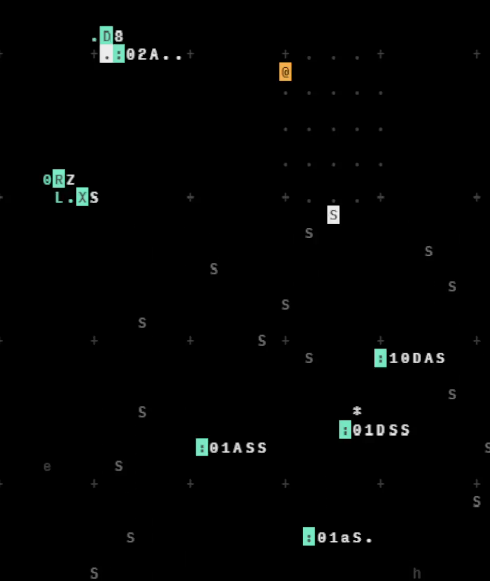
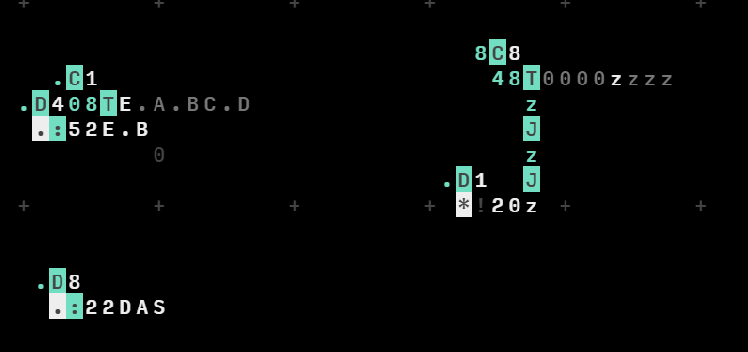

# 96lab orca set

`orca-1.1.als`

## Intro -- The ambient



Constant 8th frame loop
```
.D8.....
..:02A..
```

Falling South triggers. Use 0 to Z randomizer and then X (write) to write but offsetted with the randomizer.
```
0RZh.
...XS
```

Midi triggers to catch the falling souths
```
:10DAS
:01DSS
:01ASS
:01aS.
```

You can comment and uncomment the midi triggers for silence periods.

Transition to the next scene by placing the kick drum on the 1st frame.
And making it sound more random.


Make the kick align with the randomizer like so
```
0R2......
.0.XS....
...S.....
.........
....*....
...:10DAS
```

## Act II -- Englihtenment Techno

Now make the kick a 4 frame loop
```
.D4.....
..:10DAS
```

And play around with the constant 8th frame loop by changing it to 6th frame loop.

Random hihats
`:22DAS`
```
0R2......
.0.XS....
...S.....
.........
....S....
...:22DAS
```

Give the 1st channel granulator some random love.
Play around with the octave!
```
.0R2.......
..1.XS.....
.....S.....
...........
....S......
.....:01DAS
```

Play drums and transition into next section

## Act III -- Sub attack
Add a Clock, a Track, and a MIDI to the 5th channel (Sub bass).
```
...C..........
.D228TA.A.BC.D
.*:52A.B......
```

You want to play with the sustain of the MIDI

Change the hats to 8th frame loop

Now transition into a 4th frame loop sub bass
```
...C1.........
.D408TE.A.BC.D
..:52E.B......
```

The sub bass has an echo wet/dry knob. This sets a track to wet it every 4th frame.
```
..8C8.........
...48T0000zzzz
.....z........
.....J........
.....z........
.D1..J........
.*!20z........
```

Should look a little like this



Hat/Snare thing sounds a bit dry right now... Give some delay
```
!400 #delaypass
!40A #delaywet
!501 #delaytime
```

Bridging sub echo with the hats delay

```
..8C8.........
...58T0000zzzz
.....z........
.....J........
.....z........
.D1..J........
.*!20z........
.....J........
...2MzYzYz....
....y....J0.0.
....D1.1Zz....
....*!50b.....
```

Now go kill the sub bass and hats and transition into the next section
Send a signal to maximize the wetness of the delay on the hats
```
E.!40Z
```

Kill the track of the wet dry and play with the values manually

## Act IV -- Twilight
Fun granulator part!! Using a DENONBU song as a base
```
.D4.....
.*:73CZZ
```

Then go into
```
.D1.....
.*:73CZZ
```